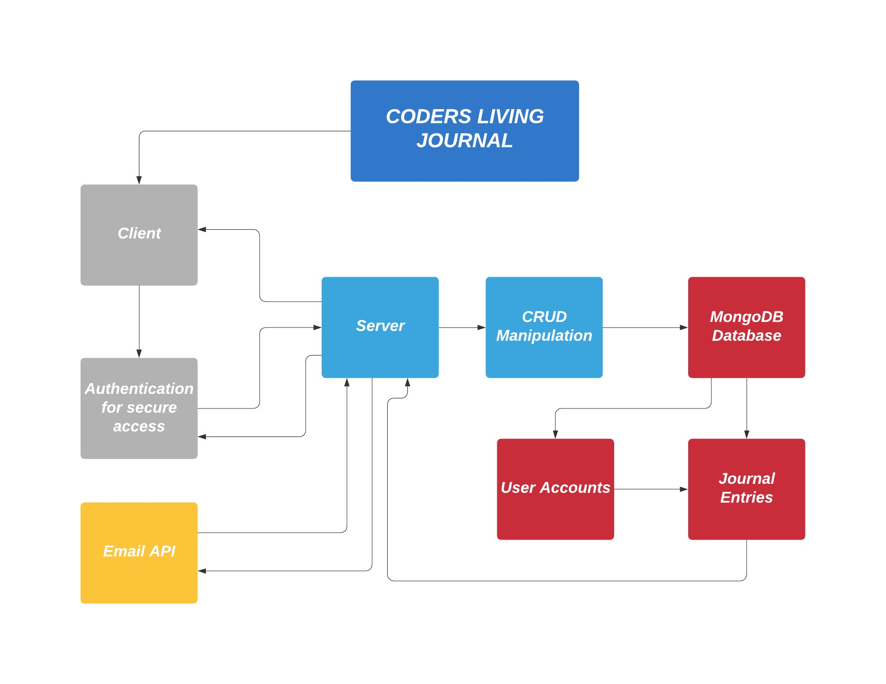

# Coders Living Instant Journal
__Version 1.1.2__  
__Authors__ Eugene Monnier, Andrew Kyllo, Peter Cole  
- CLI-J is an application that allows the user to create, read, update, and delete categorized journal entries easily from their terminal
- After creating an account, associated with an e-mail address, the user can configure the application to automatically send daily/weekly/monthly e-mails to their e-mail address containing the notes from that time period
- The purpose is to allow the user to quickly create and collect notes for meetings and other work events

### Instructions
- `npm i -g` the CLIJ package
- `clij` to start the app

## [Project Management Board](https://github.com/Coders-Living-Instant-Work-Journal/coders-living-instant-journal-client/projects/1)

## Domain Model

